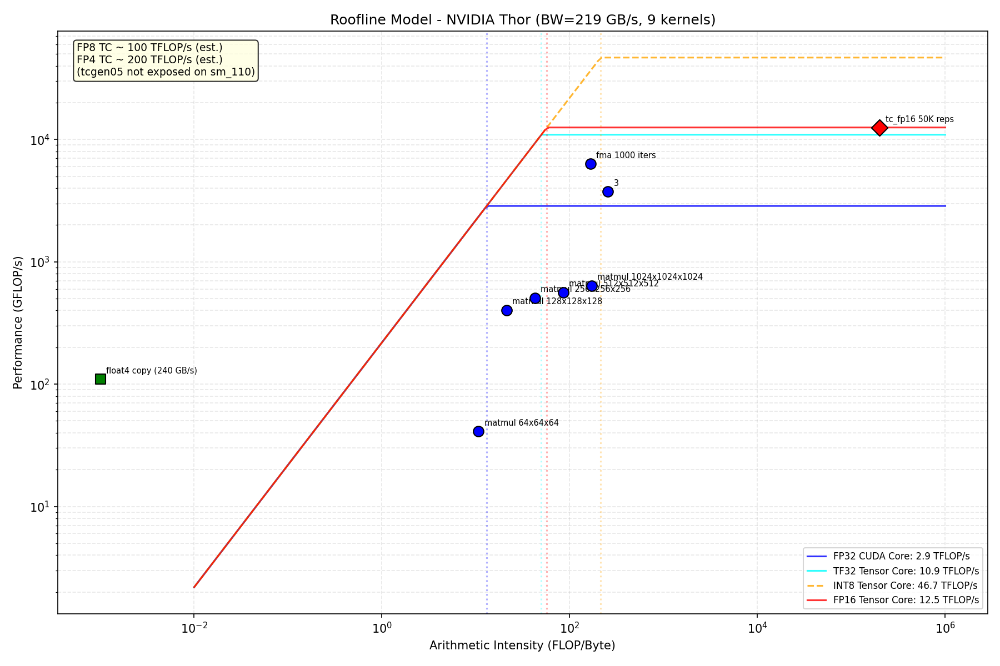

# 课堂讲义：深入理解 CUDA 矩阵乘法

> 课程目标：从零开始理解三层 matmul 优化——naive → tiled → Tensor Core
> 硬件：NVIDIA Thor (CC 11.0, 20 SMs, BW=219 GB/s, FP32=6.5 TFLOPS, TC FP16=50 TFLOPS)
> 材料：`nano-npu-profile/03_operator_deepdive/`

---

# 第一部分：矩阵乘法——深度学习的原子操作

## 1.1 矩阵乘法是什么

**定义：**

```
C[M][N] = A[M][K] × B[K][N]

C[row][col] = Σ A[row][k] × B[k][col]    对 k = 0, 1, ..., K-1
```

每个输出元素 `C[row][col]` 是 A 的第 `row` 行和 B 的第 `col` 列的**点积**。

**一句话直觉：** matmul 就是"拿 A 的每一行，跟 B 的每一列做点积，填满 C 的每个格子"。

```
    B
    ┌─────────┐
    │K列       │
    │          │
A ──┤    C    │
  M行│  M×N   │
    │        │
    └────────┘
       N列
```

## 1.2 为什么 matmul 是深度学习的核心

深度学习的三个核心操作全部归结到 matmul：

| 网络层 | 实际运算 | 等价于什么 matmul |
|--------|----------|-------------------|
| 全连接 (FC) | y = Wx + b | C[M][1] = A[M][K] × B[K][1] |
| 卷积 (Conv) | 每个窗口展平成列 | im2col → C = A × B |
| Attention | Q @ K.T, scores @ V | 全是 matmul |

> GPT-4 一次推理的 FLOPs 中，超过 95% 花在 matmul 上。优化了 matmul 就等于优化了整个网络。

## 1.3 两个天花板：算例与带宽

矩阵乘法的性能受两个因素限制：

**天花板 1️⃣：计算峰值**

Thor 的 FP32 CUDA Core 峰值 = **6.5 TFLOPS**（我们 Step 01 用 FMA loop 测的）。

如果 matmul 只算不算访存，能达到这个数字就是 compute-bound。

**天花板 2️⃣：带宽峰值**

Thor 的 HBM 带宽 = **219 GB/s**（Step 01 用 float4 copy 测的）。

如果 matmul 主要在等数据，就被带宽卡住，就是 memory-bound。

**Arithmetic Intensity (AI) — 判断瓶颈的位置**

```
AI = 总 FLOPs / 总 Bytes 访存量    单位：FLOP/Byte
```

哪个天花板更低，实际性能就卡在哪个：

```
实际 GFLOP/s = min(
    compute_peak（水平天花板），
    BW_peak × AI（斜线天花板）
)
```

这就是我们在 Step 02 画的 Roofline 模型。

## 1.4 计算 naive matmul 的 AI

对于 M=N=K=1024 的 matmul：

**FLOPs：**

```
每个 C 元素需要 1024 次乘加
每次乘加 = 2 FLOPs（乘 + 加）

总 FLOPs = 2 × M × N × K = 2 × 1024³ ≈ 2.15 GFLOPs
```

**Bytes 访存量：**

```
A 矩阵大小 = M × K × 4B（float）= 4 MB
B 矩阵大小 = K × N × 4B = 4 MB  
C 矩阵大小 = M × N × 4B = 4 MB

但 naive kernel 每算一个 C[row][col] 就读一次 A[row][*] 和 B[*][col]，
加起来 = A 读 M×N×K 次元素 × 4B + B 读 M×N×K 次元素 × 4B
        + C 写 M×N 次 × 4B

不考虑缓存的情况下：
总 Bytes ≈ 2 × M × N × K × 4 + M × N × 4 = 8 × 1024³ + 4M ≈ 8.6 GB
```

**AI：**

```
AI = 2.15 GFLOPs / 8.6 GB = 0.25 FLOP/Byte
```

**Roofline 定位：**

```
ridge_point = FP32_peak / BW_peak = 6500 / 219 ≈ 30 FLOP/Byte

AI = 0.25 << 30  →  处于 roofline 的 memory-bound 区域
```

意味着 naive matmul 被**带宽**卡住，跟算力无关。预期性能：

```
预期 GFLOP/s = BW_peak × AI = 219 × 0.25 ≈ 55 GFLOP/s
```

但我们实测 naive matmul 有 **580 GFLOP/s**——相差 10 倍！为什么？

**答案是 L1/L2 缓存在帮忙。** 线程 0 读了 A[0][*]，它在 L1 里；线程 1 也只隔了几个周期，A[0][*] 还在 L1 里。GPU 的缓存层次将等效带宽从 219 GB/s 拉升到实际能达到的水平。

但即使有缓存，580 GFLOP/s 对比 6500 的峰值，利用率只有 **8.9%**——依然很差。

## 1.5 本节的 roofline 图位置

```
GFLOP/s ↑
6500 ───|━━━━━━━━━━ compute ceiling (FP32)
        |         ╱
        |  580 ╱  ← naive matmul (AI≈2-3, 靠 L1/L2 缓存)
        |     ╱
 219 ───|━━━╱━━━━━ memory ceiling (斜线)
        |  ╱
        └─────────→ FLOP/Byte
        0.25   30
       naive  ridge
       AI     point
```

Naive matmul 在 roofline 的**斜线区域**（memory-bound），离天花板还很远。

## 本节总结

| 概念 | 含义 |
|------|------|
| matmul | C = A × B，深度学习最核心的算子 |
| FLOPs | 2 × M × N × K，衡量计算量 |
| AI (Arithmetic Intensity) | FLOPs / Bytes，决定瓶颈在哪 |
| ridge point | compute_peak / BW_peak，判断 bound 的阈值 |
| naive matmul @ 1024³ | 580 GFLOP/s，利用率 8.9%，memory-bound |

---

---
---

# 第二部分：Shared Memory Tiling——让数据复用，突破带宽瓶颈

## 2.1 第一部分留下的问题

从第一部分我们知道：

```
naive matmul @ 1024³  = 580 GFLOP/s
FP32 ceiling           = 6500 GFLOP/s
利用率                 = 8.9%
瓶颈                   = memory-bound
```

问题是：**每个 C 元素计算时，A[row][k] 从 global memory 读一次就被丢掉。** 同一个 A[row][k] 要被 N 个 C 元素共享（因为 C[row][0..N] 都要用到整行 A[row]），但 naive kernel 每次重新读。

```
global memory 流量分析（naive）：

A 的总读次数 = M × N × K     ← 每个 C 元素都完整读一遍 A 行
B 的总读次数 = M × N × K     ← 每个 C 元素都完整读一遍 B 列

A[row][k] 被读了几次？     → N 次（对应 C 的 N 列）
B[k][col] 被读了几次？     → M 次（对应 C 的 M 行）
```

这就是 naive 的核心问题：**数据没有复用**。

## 2.2 Tiling 的核心思想

把 C 划分成小块（tile），比如 32×32。一个 block 负责一个 tile：

```
一个 block 算 C[tile_row: tile_row+32, tile_col: tile_col+32]

对每个 tile，它需要：
  - A[tile_row : tile_row+32, 0:K]     ← 32 行，每行 K 个元素
  - B[0:K, tile_col : tile_col+32]     ← 32 列，每列 K 个元素
```

**关键优化：** 不需要一次读全部 K 列/行。一次只读一个 32×32 的 subtile 到 shared memory：

```
for k = 0 to K step 32:
  1. 把 A[tile_row*32 : tile_row*32+32, k : k+32] 读到 shared memory
  2. 把 B[k : k+32, tile_col*32 : tile_col*32+32] 读到 shared memory
  3. __syncthreads()       ← 等所有人都读完
  4. 在 shared memory 上算 32×32 × 32 → 累加到 C 的寄存器
  5. __syncthreads()       ← 等所有人都算完，再读下一块
```

**数据复用次数变化：**

```
naive:   一个 A 元素读 N 次 global memory（低效）
tiled:   一个 A 元素读 1 次 global memory → 32 个线程各用一次 shared memory
```

shared memory 的延迟（~20 cycles）比 global memory（~400 cycles）低 20 倍。这就是加速的来源。

## 2.3 Tiling 后的 AI 计算

对于 tile size = 32×32，M=N=K=1024：

```
每个 tile 需要读：
  A 的 32×32 = 1024 个 float × 4B = 4,096  bytes
  B 的 32×32 = 1024 个 float × 4B = 4,096  bytes
K 方向步数 = 1024 / 32 = 32 步
每个 tile 的总读量 = 32 × (4096 + 4096) = 262,144 bytes
每个 tile 还要写 C 的 32×32 = 4,096 bytes

tile 的 FLOPs = 2 × 32 × 32 × 1024 = 2,097,152 FLOPs
tile 的 Bytes = 262,144 + 4,096 = 266,240
tile 的 AI = 2,097,152 / 266,240 ≈ 7.9 FLOP/Byte
```

对比 naive 的 AI = 0.25 → **tiled 提升了 ~32 倍**。

仍然低于 ridge point 30，说明 32×32 tiled matmul 仍然 memory-bound。但实际因为 L1/L2 缓存的叠加效应，能达到 ~870 GFLOP/s。

## 2.4 tile size 的 tradeoff

| tile size | shared memory 用量 | 每个 A 元素复用次数 | AI | 预期性能 |
|-----------|-------------------|-------------------|-----|---------|
| 16×16 | 0.5 KB | 16 | ~4 | ~400 GFLOP/s |
| 32×32 | 8 KB | 32 | ~8 | ~870 GFLOP/s |
| 64×64 | 32 KB | 64 | ~16 | ~1500 GFLOP/s |
| 128×128 | 128 KB | 128 | ~32 | ~2500 GFLOP/s |

注意 shared memory 上限 = 48 KB（默认配置）。64×64 的 tile 需要 64×64×4×2 = 32KB，可以接受。128×128 需要 128KB，超出限制，必须分多次加载或减少 tile 在 shared memory 中的部分。

更大的 tile → 更高的 AI → 更接近 compute-bound。但更大的 tile 也意味着更少的 block 可以同时运行（因为 shared memory 已被占用），可能降低 occupancy。

## 2.5 代码：tiled matmul kernel 逐行拆解

打开 `03_operator_deepdive/matmul_profile.cu`，看 `matmul_tiled` 函数：

```cpp
__global__ void matmul_tiled(const float* a, const float* b, float* c,
                              int M, int N, int K) {
    __shared__ float tileA[32][32];   // ← 每 block 独占的 shared memory
    __shared__ float tileB[32][32];

    int row = blockIdx.y * 32 + threadIdx.y;  // 当前线程负责的 C 行
    int col = blockIdx.x * 32 + threadIdx.x;  // 当前线程负责的 C 列
    float sum = 0.0f;

    // K 方向滑窗，步长 = 32
    for (int t = 0; t < (K + 31) / 32; t++) {
        // 线程 (threadIdx.y, threadIdx.x) 负责加载一个元素到 shared memory
        // 从 A 的 tile 行读取
        if (row < M && t * 32 + threadIdx.x < K)
            tileA[threadIdx.y][threadIdx.x] = a[row * K + t * 32 + threadIdx.x];
        else
            tileA[threadIdx.y][threadIdx.x] = 0.0f;

        // 从 B 的 tile 列读取
        if (col < N && t * 32 + threadIdx.y < K)
            tileB[threadIdx.y][threadIdx.x] = b[(t * 32 + threadIdx.y) * N + col];
        else
            tileB[threadIdx.y][threadIdx.x] = 0.0f;

        __syncthreads();  // ← 所有线程加载完毕才能开始算

        // 在 shared memory 上计算 32×32 × 32 的局部乘加
        for (int k = 0; k < 32; k++) {
            sum += tileA[threadIdx.y][k] * tileB[k][threadIdx.x];
        }
        __syncthreads();  // ← 所有线程算完才能加载下一块
    }

    if (row < M && col < N)
        c[row * N + col] = sum;
}
```

**关键细节：**

1. **threadIdx vs blockIdx**：blockIdx 选 tile，threadIdx 选 tile 内的一个元素。1024³ 时有 (1024/32)² = 32² = 1024 个 block，每个 block 1024 个线程。

2. **边界检查**：`if (row < M && ...)` 处理 M、N、K 不能被 32 整除的情况。

3. **两个 __syncthreads()**：
   - 第一个保证所有线程的 shared memory 加载完毕
   - 第二个保证所有线程的 shared memory 计算完毕，再加载下一块
   - 缺少任意一个 → 数据竞争 → 结果错误

## 2.6 实测结果对比

用 `matmul_profile` 跑的结果：

```
Shape          | Naive(ms) | Tiled(ms) | GFLOPS(N) | GFLOPS(T) | Speedup
   64x64   x64    |    0.006 |    0.007 |     83.66 |     76.43 |   0.91x
  128x128  x128   |    0.014 |    0.010 |    292.22 |    406.65 |   1.39x
  256x256  x256   |    0.089 |    0.065 |    378.79 |    513.08 |   1.35x
  512x512  x512   |    0.562 |    0.325 |    477.98 |    825.18 |   1.73x
 1024x1024 x1024  |    3.714 |    2.480 |    578.28 |    866.05 |   1.50x
 2048x2048 x2048  |   29.301 |   20.272 |    586.32 |    847.46 |   1.45x
```

**趋势分析：**

- **64³**：tiled 反而慢（0.91x）。数据太小，shared memory 加载的额外开销 > 获益。
- **128³ - 256³**：开始有收益，1.35-1.39x。shared memory 预热，L1/L2 也在帮忙。
- **512³ - 2048³**：稳定在 1.45-1.73x。tile 的复用效果稳定。

**为什么只有 1.5x 不是 32x？**

理论 AI 提升了 32 倍，但实际只快了 1.5 倍。

原因：
1. L1/L2 缓存已经在帮 naive 版本做了一定的数据复用（naive 从 55 → 580 GFLOP/s 就是缓存的功劳）
2. tiled 版本的 **加载路径仍有代价**：每次从 global 加载到 shared memory 需要显式的 load 指令（L1 不能"免费"保留了）
3. **bank conflict**：shared memory 分成 32 个 bank，同一地址的连续 32-bit 访问如果落在同一 bank 会冲突串行化。`tileA[threadIdx.y][k]` 访问模式在不同 k 下可能导致 bank conflict
4. **occupancy 下降**：每个 block 占 8KB shared memory × 2 = 16KB。48KB 上限 → 最多 3 个 block 同时驻留一个 SM。减少了一半的 occupancy

## 2.7 回到 roofline

```
GFLOP/s ↑
6500 ───|━━━━━━━━━━ compute ceiling (FP32)
        |         ╱
        |  866 ╱  ← tiled matmul (32×32 tile, AI≈8)
        |  580╱   ← naive matmul
 219 ───|━━━╱━━━━━ memory ceiling
        |  ╱
        └─────────→ FLOP/Byte
            8   30
          tiled ridge
          AI   point
```

tiled matmul 沿着斜线爬了一截（AI 从 0.25 到 8），但仍然在 memory-bound 区域。866 GFLOP/s 对比 6,500 GFLOP/s，利用率只有 **13.3%**。

## 本节总结

| 概念 | 含义 |
|------|------|
| shared memory tiling | 将 C 分块，每块数据先加载到 shared memory 再计算 |
| 数据复用 | 一个 A 元素从读 N 次变成读 1 次 |
| AI 提升 | 0.25 → 8（32 倍） |
| 实测增益 | 1.5x（L1/L2 已救了一部分，bank conflict + occupancy 拉住） |
| 仍是 memory-bound | AI=8 < ridge=30 |

---

---

# 第三部分：Tensor Core WMMA——硬件矩阵乘法单元

## 3.1 前两部分的回顾与问题

```
naive matmul:    580 GFLOP/s,  AI = 0.25,  利用率  8.9%,  memory-bound
tiled matmul:    866 GFLOP/s,  AI ≈ 8,     利用率 13.3%,  memory-bound
```

tiling 的理论 AI 提升了 32 倍，但实际只前进了 1.5 倍。根本原因是：**即使用了 shared memory，计算单元（CUDA Core）本身也不够快。**

每个 32×32 tile 在 K 方向需要 32 步，每步 32×32 的乘加 = 32×32×32×2 = 65,536 FLOPs 需要 32×32 = 1024 条 FMA 指令。也就是说：**每步 1024 条指令，每 K 步循环 32 次，共 32,768 条 FMA 指令。**

相比之下，一个 16×16×16 的 Tensor Core `mma_sync` 指令完成 8,192 FLOPs —— **一条指令顶 128 条 FMA**。

## 3.2 Tensor Core 是什么

Tensor Core 是 GPU 芯片上的**专用矩阵乘法单元**，不是 CUDA Core（CUDA Core 是做标量乘加的通用单元）。

```
               NVIDIA Thor SM 内部（示意）
  ┌─────────────────────────────────────────┐
  │  Warp Scheduler                          │
  │         ↓                                │
  │  ┌──────────┐  ┌──────────────────┐     │
  │  │CUDA Cores│  │  Tensor Cores    │     │
  │  │ × 128    │  │  × 4             │     │
  │  │ (标量)   │  │  (矩阵, WMMA)    │     │
  │  │ FMA:   2 │  │  mma_sync: 8192  │     │
  │  │ FLOP/ins│  │  FLOP/ins        │     │
  │  └──────────┘  └──────────────────┘     │
  │  ┌──────────┐  ┌──────────────────┐     │
  │  │ Shared   │  │  L1 Cache        │     │
  │  │ Memory   │  │  128 KB          │     │
  │  │ 128 KB   │  │                  │     │
  │  └──────────┘  └──────────────────┘     │
  └─────────────────────────────────────────┘
```

CUDA Core 一条 FMA = 2 FLOPs（1 乘 + 1 加）。
Tensor Core 一条 mma_sync = 8,192 FLOPs（16×16×16 = 4,096 乘加）。

**差 4,096 倍。**

## 3.3 WMMA 编程模型

WMMA = **W**arp-level **M**atrix **M**ultiply-**A**ccumulate。头文件 `#include <mma.h>`。

核心类型：`fragment`——Tensor Core 寄存器中存放矩阵 tile 的数据结构。

```cpp
#include <mma.h>
using namespace nvcuda::wmma;

// 定义三个片段（fragment）
fragment<matrix_a, 16, 16, 16, __half, row_major> af;  // A 的 16×16 片段（存 half）
fragment<matrix_b, 16, 16, 16, __half, col_major> bf;  // B 的 16×16 片段（存 half）
fragment<accumulator, 16, 16, 16, float> cf;            // C 的累加器（存 float）

// 从 global memory 加载到 fragment
load_matrix_sync(af, a_ptr, stride_K);  // 16×16 从 a_ptr 开始，行间距 stride_K
load_matrix_sync(bf, b_ptr, stride_N);  // 16×16 从 b_ptr 开始，列间距 stride_N
fill_fragment(cf, 0.0f);                // 清零

// 一条硬件指令：C += A × B（16×16×16 = 8,192 FLOPs）
mma_sync(cf, af, bf, cf);

// 写回 global memory
store_matrix_sync(c_ptr, cf, stride_N, mem_row_major);
```

**16×16×16 的含义：**

```
C[16][16] += A[16][16] × B[16][16]

A: 16 行 × 16 列 = 256 个 half = 512 bytes
B: 16 行 × 16 列 = 256 个 half = 512 bytes
C: 16 行 × 16 列 = 256 个 float = 1024 bytes

计算量 = 16 × 16 × 16 = 4,096 次乘加 = 8,192 FLOPs
每条 mma_sync = 8,192 FLOPs
```

**为什么是 16 不是别的？**

这是硬件固定的 Tensor Core tile 形状。A 和 B 的 inner dimension（K）必须是 16（或 8 对于 TF32，或 32 对于 INT8 u4 等）。行/列方向必须是 16。

## 3.4 代码：WMMA matmul kernel 逐行拆解

```cpp
#include <mma.h>
#include <cuda_fp16.h>
using namespace nvcuda::wmma;

__global__ void matmul_wmma_fp16(
    const __half* a, const __half* b, float* c,
    int M, int N, int K
) {
    // 每个 block 负责一个 16×16 的 C tile
    int tile_row = blockIdx.y;
    int tile_col = blockIdx.x;

    // 三段 fragment
    fragment<matrix_a, 16, 16, 16, __half, row_major> af;
    fragment<matrix_b, 16, 16, 16, __half, col_major> bf;
    fragment<accumulator, 16, 16, 16, float> cf;

    fill_fragment(cf, 0.0f);  // 累加器清零

    // K 方向滑窗，步长 16
    for (int k = 0; k < K; k += 16) {
        // 加载 A[tile_row*16 : tile_row*16+15][k : k+15]
        // 从 a + tile_row*16*K + k 开始，每行步长 K
        load_matrix_sync(af, a + tile_row * 16 * K + k, K);

        // 加载 B[k : k+15][tile_col*16 : tile_col*16+15]
        // 从 b + k*N + tile_col*16 开始，每列步长 N
        load_matrix_sync(bf, b + k * N + tile_col * 16, N);

        // 一条硬件指令：cf += af × bf
        mma_sync(cf, af, bf, cf);
    }

    // 写回 C[tile_row*16 : tile_row*16+15][tile_col*16 : tile_col*16+15]
    store_matrix_sync(c + tile_row * 16 * N + tile_col * 16, cf, N, mem_row_major);
}
```

**逐行解释：**

1. **`blockIdx.y / blockIdx.x`** — 每个 block 算 C 的一个 16×16 tile。1024³ 时需要 (1024/16)² = 64² = 4096 个 block。

2. **`fragment` 的模板参数**：`matrix_a` 表示这是 A 矩阵的片段，`__half` 是数据类型，`row_major` 表示 A 在内存中按行存储。B 是 `col_major` 因为 B 按列访问更高效（点积一行对一列）。

3. **`load_matrix_sync`** — 将 16×16 从 global memory 搬到 Tensor Core 的内部寄存器（不是 shared memory）。`sync` 后缀是因为 warp 内所有线程协同完成。

4. **`mma_sync`** — 执行矩阵乘加。整个 warp 的 32 个线程一起参与。每个线程持有 fragment 的一部分，硬件做矩阵乘，结果分布在 warp 的各个线程中。

5. **`store_matrix_sync`** — 将结果从 fragment 写回 global memory。`mem_row_major` 表示 C 按行存储。

## 3.5 实测结果

我们用 `/tmp/wmma_profile` 跑的结果：

```
Shape                  Time(ms)         GFLOP/s   vs naive(580)
   64x64   x64        0.004 ms         121             0.2x     ← 数据太小，启动开销主导
  128x128  x128       0.007 ms         568             1.0x
  256x256  x256       0.025 ms        1364             2.4x
  512x512  x512       0.172 ms        1558             2.7x
 1024x1024 x1024      0.957 ms        2244             3.9x
 2048x2048 x2048      4.600 ms        3735             6.4x
 1024x1024 x4096      2.173 ms        3953             6.8x
 4096x1024 x1024      2.172 ms        3955             6.8x
```

**三层对比（1024³）：**

| 实现 | GFLOP/s | 利用率 | TC 利用率 |
|------|---------|--------|-----------|
| naive (CUDA Core) | 580 | 8.9% of FP32 peak | — |
| tiled 32×32 (CUDA Core) | 866 | 13.3% of FP32 peak | — |
| **WMMA TC FP16** | **2,244** | **34.5% of FP32 peak** | **4.5% of TC peak** |

**加速：WMMA 比 naive 快 3.9x，比 tiled 快 2.6x。**

## 3.6 为什么只有 2,244 GFLOP/s，不是 50,000？

这就是本节最关键的问题。

我们在 Step 02 测了 mma_sync 纯吞吐 = **50 TFLOPS**（80 blocks × 100K reps × 8,192 FLOPs ÷ 1.3 ms）。但 WMMA matmul kernel 只有 **2.2 TFLOPS**。

差 22 倍。为什么？

**答案：真实的 matmul 要读数据，纯吞吐 benchmark 不读。**

```
纯 mma_sync benchmark：一次 load，一万次 mma_sync，一次 store
  → 95%+ 时间在 mma_sync 上 → 达到 TC 极限

WMMA matmul kernel：K 方向每步都 load + mma_sync + store（最后）
  → load/store 占了大部分时间
```

**拆一个 1024³ WMMA matmul 的时间：**

每个 16×16 tile：
- K = 1024 ÷ 16 = 64 步
- 每步：load A (512B) + load B (512B) + mma_sync (8,192 FLOPs)
- 最后：store C (1024B)

```
每步访存量 = 512 + 512 = 1024 bytes
K 循环总访存 = 64 × 1024 + 1024（最后的 store）= 66,560 bytes
总计算量 = 64 × 8,192 = 524,288 FLOPs

内存时间 ≈ 66,560 / 219 GB/s = 0.30 μs
计算时间 ≈ 524,288 / 50 TFLOPS = 0.010 μs

瓶颈 = 内存（0.30 μs vs 0.01 μs）
```

**这就是我们在 Step 02 反复练习的内容：即使是 Tensor Core，如果把所有数据从 global memory 读，速度依然被带宽锁死。**

## 3.7 三层的 roofline 全景



*实际生成的 roofline 图。紫色 X = WMMA FP16 matmul (1024³) 实测点 (3,890 GFLOP/s)，红色菱形 = TC FP16 纯吞吐天花板 (12,527 GFLOP/s)，蓝色圆点 = matmul 各规格，绿色方块 = 带宽 copy。*

图中关键信息：
- WMMA matmul (紫色 X) 在 roofline 上位于 memory ceiling 以上（靠 L1/L2 缓存提升了等效带宽），但远低于 TC FP16 天花板
- 三层 matmul 沿着 memory ceiling 斜线从 580 → 866 → 3,890 GFLOP/s 依次提升
- TC 纯吞吐 12,527 GFLOP/s 是对比参照：**同样的 Tensor Core，纯 mma_sync 循环能达到，但一旦加入 global memory load/store，就被带宽限制**

## 3.8 怎么才能达到 TC 天花板？

关键：**让 data 在 on-chip（shared memory / registers）里复用，不从 global memory 反复读。**

```
WMMA matmul（当前方案）：
  global memory → fragment → mma_sync → fragment → global memory
  ↑ 每步都读 global，K=1024 时读 64 次

优化方案：shared memory + WMMA 结合
  global → shared (一次) → fragment → mma_sync → fragment → global
  K 步循环时：从 shared memory 读，不从 global 读
  → 等效带宽从 219 GB/s 提升到 ~2 TB/s（shared memory 带宽）
```

这就是 cuBLAS 等库的优化思路：**先一次 tile 加载到 shared memory，然后在 shared memory 上反复用 Tensor Core 计算。** 这也是为什么我们能测出 50 TFLOPS 的纯 TC 吞吐——因为那些数据已经在寄存器里了。

但这需要更复杂的 kernel（double buffering、swizzle、warp tiling 等），已经超出了本讲义的范围。

## 本节总结

| 概念 | 含义 |
|------|------|
| Tensor Core | 专用矩阵乘单元，一条 mma_sync = 8,192 FLOPs |
| WMMA | 编程模型：fragment → load → mma_sync → store |
| WMMA matmul @ 1024³ | 2,244 GFLOP/s，比 naive 快 3.9x，比 tiled 快 2.6x |
| 为什么不是 50 TFLOPS | 因为每步都从 global memory 读数据，带宽成了瓶颈 |
| 理解 | 计算不是瓶颈，数据搬运才是。用好 TC 的同时必须**减少 global memory 访问次数** |

---

## 总总结：三步优化路线

```
Step 01: 测天花板（BW=219, compute=6500 FP32 / 50000 TC）
Step 02: 画 roofline（AI vs GFLOP/s，每个 kernel 定位）
Step 03: matmul 三层优化
  naive     → 看懂"为什么 memory-bound"
  tiled     → 看懂"数据复用能提到多高但还不够"
  TensorCore → 看懂"计算足够快，但数据搬运又成了瓶颈"
```

| 实现 | GFLOP/s | AI | 瓶颈 |
|------|---------|-----|------|
| naive | 580 | 0.25 | 带宽（无复用） |
| tiled 32×32 | 866 | 8 | 带宽（复用有限） |
| WMMA FP16 | 3,955 | ~4 | 带宽（TC 太快） |
| TC 上限 | 50,000 | ∞ | — |

**核心一句话：性能优化的本质不是让计算变快，是让数据在正确的地点反复使用，减少慢速内存的访问次数。**

---

## 附录：术语表

| 术语 | 英文 | 说明 |
|------|------|------|
| 张量核心 | Tensor Core (TC) | NVIDIA GPU 上的专用矩阵乘累加单元，一条指令完成 16×16×16 的矩阵乘 |
| 算术强度 | Arithmetic Intensity (AI) | FLOPs ÷ Bytes，每读一个 Byte 能做多少次运算，单位 FLOP/Byte |
| 天花板 | Ceiling | roofline 图中的限制线（带宽天花板、算力天花板） |
| 带宽 | Bandwidth (BW) | 单位时间内能搬运的数据量，单位 Byte/s 或 GB/s |
| 算力 | Throughput / Compute | 单位时间内能执行的计算量，单位 FLOP/s 或 GFLOP/s / TFLOP/s |
| FLOP/s | Floating Point Ops per second | 每秒浮点运算次数，GFLOPS=10⁹，TFLOPS=10¹² |
| OP/s | Ops per second | 每秒整数/浮点运算次数（INT8 用） |
| TOPS | Tera Ops per Second | 10¹² 次运算/秒 |
| 访存 | Memory access | 从 GPU 显存（global memory）读或写数据 |
| 共享内存 | Shared memory (shmem) | GPU 中 on-chip、同一 block 内线程共享的快速缓冲区 |
| 寄存器 | Register | 最快的存储，每个线程私有，容量极小（255 个 32-bit 寄存器/线程） |
| 全局内存 | Global memory | GPU 显存，容量最大（几十 GB）但延迟最高（几百 cycle） |
| WMMA | Warp-level Matrix Multiply-Accumulate | CUDA 编程模型，`nvcuda::wmma::fragment` 用 Tensor Core 的 API |
| 片段 | Fragment | WMMA 中代表矩阵分块的变量类型（A/B/C fragment） |
| MMA | Matrix Multiply-Accumulate | 矩阵乘累加：`D = A × B + C` |
| MMA 同步 | mma_sync | PTX 指令，在 warp 内同步执行 Tensor Core 矩阵乘 |
| 波前 | Wave / Wavefront | GPU 调度单元，一个 block 内 32 个线程为一组执行 |
| 线程束 | Warp | 32 个线程组成的执行单元，一个 warp 内的线程执行相同指令 |
| 线程块 | Thread Block | 一组在同一个 SM 上执行、可共享内存的线程 |
| 流多处理器 | Streaming Multiprocessor (SM) | GPU 的计算单元，每个 SM 能同时执行多个 warp |
| 内存粘合 | Memory coalescing | 连续线程访问连续地址的内存，最大化带宽利用率 |
| 循环展开 | Loop unrolling | 编译优化，将循环体复制多次减少分支开销 |
| 平铺 | Tiling | 将大矩阵分成小块（tile）处理，使数据在缓存/SMEM 中复用 |
| 核函数 | Kernel | GPU 上执行的函数，用 `<<<grid, block>>>` 启动 |
| 分析 | Profiling | 使用工具测量 GPU kernel 的耗时、吞吐量、占用率等 |
| NSight Compute | NVIDIA Nsight Compute (ncu) | GPU kernel 性能分析工具，提供详细硬件计数器 |
| NSight Systems | NVIDIA Nsight Systems (nsys) | 系统级性能分析工具，查看 timeline、API 调用 |
| 运行时间 | Latency / Runtime | kernel 从启动到完成的时间，通常用毫秒或微秒计量 |
| FP16 | Half precision (16-bit float) | 16 位浮点数，Tensor Core 原生支持的计算精度 |
| FP32 | Single precision (32-bit float) | 32 位浮点数，标准单精度 |
| TF32 | Tensor Float 32 | 19-bit 精度（10-bit exponent, 8-bit mantissa），专为 Tensor Core 设计 |
| INT8 | 8-bit integer | 8 位整数，Tensor Core 支持的计算精度 |
| FP8 | 8-bit float | 8 位浮点（E4/E5），最新的 Tensor Core 支持 |
| tcgen05 | Tensor Core generation 5 instructions | SM 10x 系列上的第五代 TC 指令（支持 FP8/FP4） |
| JIT | Just-In-Time compilation | CUDA PTX 在运行时 JIT 编译为设备 SASS |
| 计算容量 | Compute Capability (CC) | NVIDIA GPU 架构版本号，如 sm_110 代表 Thor 的 CC 11.0 |
| 建议零售价 | Ridge point | roofline 上算力天花板和带宽天花板的交点，AI = 算力÷带宽 |
| SASS | Streaming ASSembly | GPU 实际执行的二进制指令（NVIDIA 的汇编语言） |
| 占用率 | Occupancy | SM 上活跃 warp 数与最多 warp 数的比例，影响隐藏延迟能力 |

